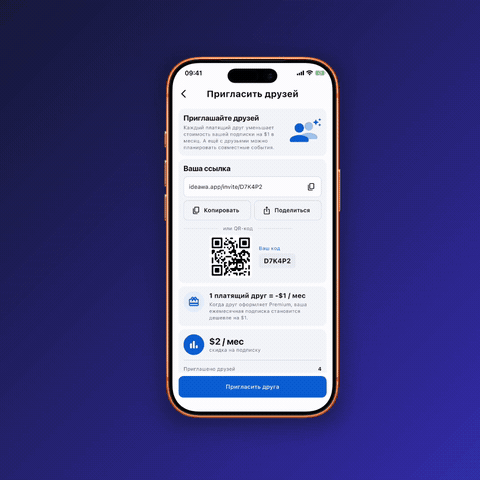
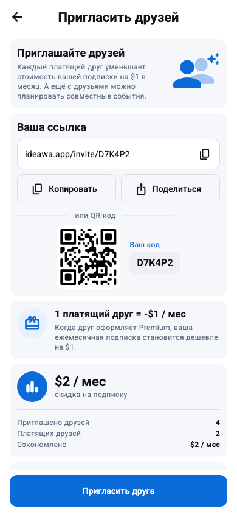
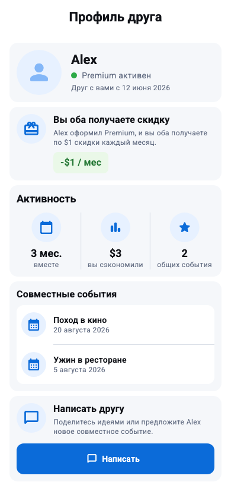
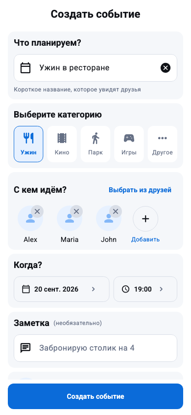

# Invite Friends — Flutter

Тестовое Flutter-приложение, восстановленное по одному JPEG-референсу. Помимо основного экрана реализованы рабочие пользовательские сценарии: приглашение друга, профиль участника и создание совместного события.

<p align="center">
  <a href="docs/demo/invite-friends-demo.mp4">
    
  </a>
</p>

<p align="center">
  <a href="docs/demo/invite-friends-demo.mp4">▶ Посмотреть полную демонстрацию</a>
</p>

<p align="center">
  
  
  
</p>

## Что реализовано

- адаптивный экран приглашения друзей с закреплённой основной CTA;
- копирование полной HTTPS-ссылки с haptic- и success/error-feedback;
- системный share sheet на iOS и Android, включая корректный popover origin на iPad;
- сканируемый QR-код, содержащий ту же ссылку приглашения;
- профиль друга с текущим статусом, вкладом в скидку и совместными событиями;
- создание события: категория, участники, нативные выбор даты и времени, заметка и напоминание;
- валидация формы и обратная связь после успешного создания;
- состояния загрузки действий, ошибки и пустой список друзей;
- адаптация под компактные экраны и увеличенный системный текст;
- semantic labels, текстовые статусы и достаточные touch targets.

Все данные локальные и демонстрационные: приложение показывает законченный UI/UX-сценарий без зависимости от backend.

## Быстрый запуск

Проверенная среда: Flutter **3.47.5 stable**, Dart **3.13.4**.

```bash
flutter pub get
flutter run
```

Версия Flutter закреплена в `mise.toml`. При наличии [mise](https://mise.jdx.dev/) проект можно запустить в воспроизводимом окружении:

```bash
mise install
mise exec -- flutter run
```

## Архитектура

Проект организован по принципу **feature-first**. Границы проведены по реальным обязанностям, без слоёв и абстракций «на будущее».

```text
lib/
├── app/
│   ├── app.dart                   # composition root
│   └── app_theme.dart             # тема и design tokens
└── features/invite/
    ├── invite_actions.dart        # clipboard и системный share sheet
    ├── invite_layout.dart         # размеры и адаптивные breakpoints
    ├── invite_models.dart         # неизменяемые данные экрана
    ├── invite_screen.dart         # основной сценарий
    ├── friend_details_screen.dart # профиль друга
    ├── create_event_screen.dart   # создание события
    └── widgets/                   # переиспользуемые секции экрана
```

Основной экран декларативно строится из `InviteData`. Платформенные copy/share-действия передаются через constructor/callback injection, поэтому тестируются без подмены method channels. Краткоживущее состояние формы и share sheet остаётся рядом с использующим его экраном.

Отдельный state manager, DI-контейнер и декларативный роутер не добавлены: для трёх экранов без общего асинхронного состояния достаточно стандартных средств Flutter. Если появятся API и разделяемое состояние, repository/service и ViewModel можно добавить внутри feature, не меняя публичную границу экранов.

## Зависимости

В runtime используются только две библиотеки:

| Пакет | Назначение |
|---|---|
| [`pretty_qr_code`](https://pub.dev/packages/pretty_qr_code) | Детерминированная генерация QR-кода без сети |
| [`share_plus`](https://pub.dev/packages/share_plus) | Нативный share sheet на iOS и Android |

Clipboard, навигация, формы, date/time picker и обратная связь реализованы средствами Flutter SDK.

## Качество и тестирование

```bash
dart format --output=none --set-exit-if-changed .
flutter analyze --fatal-infos
flutter test --coverage
flutter build apk --debug
```

В проекте **24 автоматических теста**, которые проверяют:

- отображение и прокрутку всего контента;
- copy/share-сценарии, ошибки и защиту от повторного share;
- навигацию в профиль друга и создание события;
- валидацию формы и нативные date/time picker;
- единый canonical URL в ссылке, QR и действиях;
- компактный viewport 320×568 с `textScaleFactor = 2`;
- semantic labels, tap targets и WCAG-контраст текста;
- golden-снимки всех трёх экранов в viewport 390×844.

GitHub Actions повторяет форматирование, статический анализ, тесты и Android-сборку. Готовый debug APK сохраняется как artifact на семь дней.

## UI-решения и ограничения

- Цвета, размеры и отступы восстановлены по JPEG 720×1280, поэтому это визуально точная интерпретация, а не заявление о pixel-perfect без исходника Figma.
- Используется системная типографика: SF Pro на iOS и Roboto на Android.
- Контент ограничен шириной 600 dp и не растягивается на планшете.
- Нижняя CTA остаётся доступной во время прокрутки.
- Созданные события не сохраняются и не планируют системные уведомления — это локальный демонстрационный сценарий.
- Light theme соответствует референсу; не заявленная в задании dark theme намеренно не добавлялась.

## Проверено

- `flutter analyze --fatal-infos` — без замечаний;
- `flutter test` — 24/24 теста;
- ручная проверка на iPhone 16e Simulator;
- QR-код сохраняет quiet zone и кодирует `https://ideawa.app/invite/D7K4P2`.

При реализации использованы рекомендации из [Flutter Architecture Guide](https://docs.flutter.dev/app-architecture/guide), [Adaptive and responsive design](https://docs.flutter.dev/ui/adaptive-responsive), [Accessibility testing](https://docs.flutter.dev/ui/accessibility/accessibility-testing) и [Testing overview](https://docs.flutter.dev/testing/overview).
